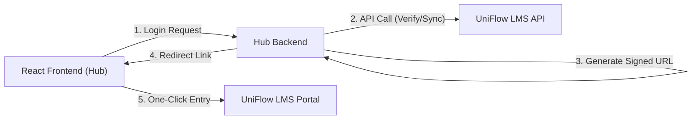

# 📘 UniFlow Hub & LMS Integration Guide

This guide provides a comprehensive technical blueprint for connecting **UniFlowHub** (The Ecosystem) with **UniFlow LMS** (The Learning Platform).

---

## 1. Architectural Overview

The integration follows a "Trusted Hub" model where the Hub acts as a portal for the LMS. To maintain security, all sensitive operations (SSO signing and credential verification) happen on the **Hub Backend**.



---

## 2. Authentication & Authorization

For system-to-system calls (e.g., verifying a student), the LMS requires **Basic Authentication** using a Superuser account.

- **Header**: `Authorization: Basic [Base64 Encoded Email:Password]`
- **Recommended**: Create a dedicated "Integration Service Account" in the LMS Staff Dashboard.

---

## 3. The Linking Handshake

Use this flow once per student to establish the "Active Integration" status.

### [POST] Link Account
`{{LMS_URL}}/api/v1/link-account/`

**Payload:**
```json
{
  "email": "student@university.edu",
  "password": "their_lms_password"
}
```

**Responses:**
| Status | Meaning | Action |
| :--- | :--- | :--- |
| `200 OK` | Valid Credentials | Mark account as linked in Hub Database. |
| `401 Unauthorized` | Invalid Credentials | Prompt user to check LMS password. |

---

## 4. Persistent Access (Auto-Login SSO)

Once linked, students should never see a login screen in the LMS. The Hub signs the email to prove they are logged in.

### Step A: Configuration
Place this in your Hub Backend's environment variables:
`LMS_SSO_SECRET=uNifLow_sSo_2026_shArEd_sEcrEt_kEy`

### Step B: URL Generation (Python Example)
```python
from django.core.signing import TimestampSigner

def get_sso_url(student_email):
    signer = TimestampSigner(salt=LMS_SSO_SECRET)
    token = signer.sign(student_email)
    return f"http://127.0.0.1:8000/portal/autologin/{token}/"
```

---

## 5. React Integration Patterns

### Syncing Data
Fetching academic data in React should always be proxied through your backend if you need to fetch as a "System". If fetching as the "User", ensure the SSO link is open first.

**API Endpoint Table:**
| Endpoint | Method | Data Returned |
| :--- | :--- | :--- |
| `/api/v1/my-modules/` | `GET` | Array of PDFs and Group-targeted resources. |
| `/api/v1/announcements/` | `GET` | Global university news feed. |

### PDF Handling
The API provides a `file_url`. Use this directly in your React components for iframe or viewer rendering:
```javascript
<iframe src={module.file_url} width="100%" height="600px" title={module.title} />
```

---

## 6. Security & Best Practices

1.  **Secret Isolation**: Never ship the `SSO_SECRET` to the React bundle.
2.  **CORS**: The LMS has `CORS_ALLOW_ALL_ORIGINS = True` for local dev. In production, whitelist your Hub's domain in `uniflow_lms/settings.py`.
3.  **Token Expiry**: SSO tokens are timestamped. If a user waits too long to click a link, the LMS will reject the token (default timeout: 30 seconds).

---

## 7. Troubleshooting

- **"Account not linked" message**: Check if the Handshake was successful and the `hub_integration_enabled` field is `True`.
- **"Signature Expired"**: Check if the system clocks on the Hub server and LMS server are synchronized (NTP).
- **"No such column"**: Ensure `python manage.py migrate core` has been run on the LMS server.
